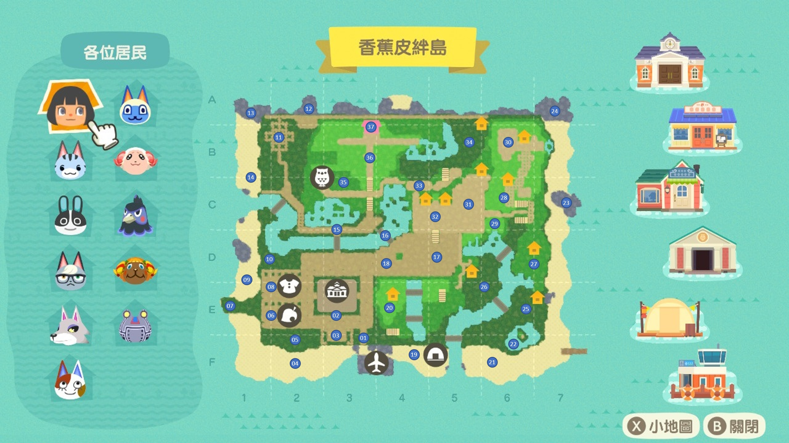
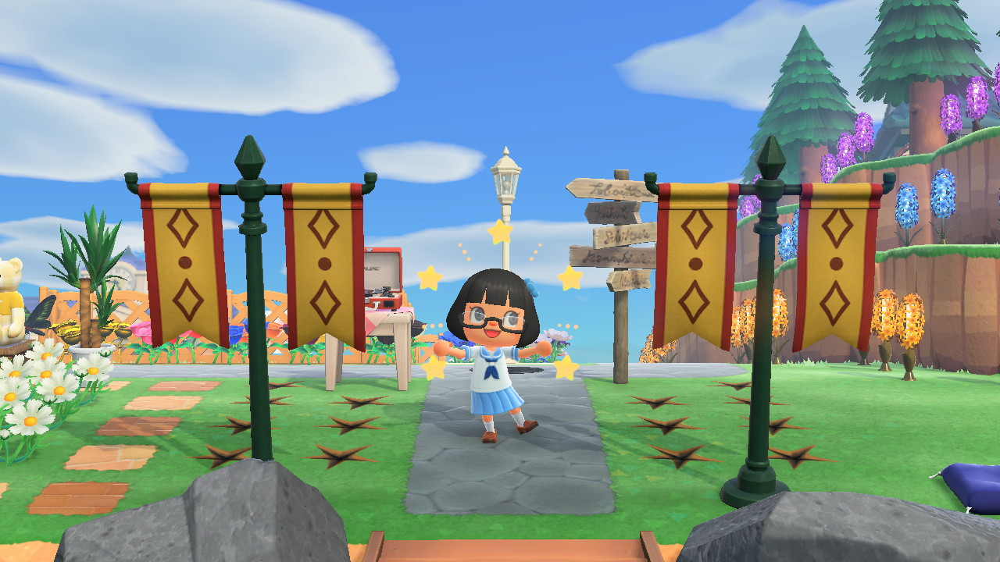
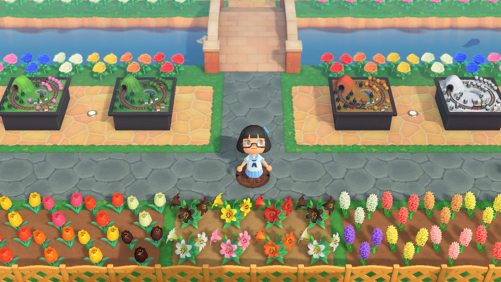
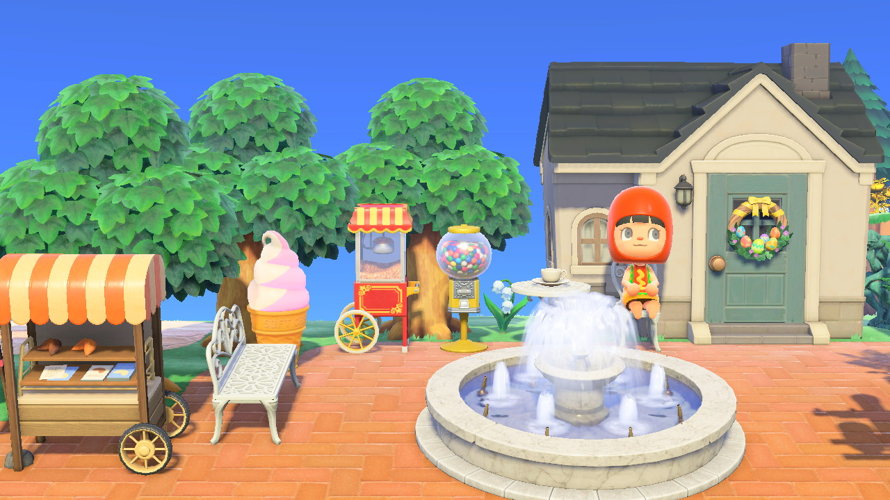

# 香蕉皮絆島 (Banana Peel Island)

## 地圖 (Map)

### 1. 門口 (Entrance)
> 🎵：[散散步 (K.K. Stroll)](https://www.youtube.com/watch?v=pMmNGG1Qw7g)

### 2. 四方花街 (Rectangular Flower Street)

### 3. 島民交誼廳 (Villagers' Lounge)

### 4. 沙灘公園 (Beach Park)

### 5. 狸貓攤販街 (Tanuki Street Vendors)

### 6. 街機柑仔店 (Arcade Gaming Grocery Store)

### 7. 釣客岬 (Angler's Cape)
> 🎵：[K.K.搖擺樂 (K.K. Swing)](https://www.youtube.com/watch?v=puj89z-MOzM)

### 8. 和服裁縫屋 (Kimono Tailor House)

### 9. 陽光海灘 (Tanning Beach)

### 10. 馬蹄灣 (Horseshoe Bend)

### 11. 六岩泉 (Six Rocks Spring)
> 🎵：[二段斜坡 (Steep Hill)](https://www.youtube.com/watch?v=hus7yE8_s5w)

### 12. 島民之墓 (Villagers' Grave)
> 🎵：[再會 (Farewell)](https://www.youtube.com/watch?v=3DzSxh8_BQE)

### 13. 貝殼王座 (Seashell Throne)
> 🎵：[動物島 (K.K. Island)](https://www.youtube.com/watch?v=6ScDrONYdVg)

### 14. 遺跡海灘 (Historic Beach)

### 15. 博物館瀑布 (Museum Falls)

### 16. 紅鸛瀑布 (Flamingo Falls)

### 17. 暴龍餐館 (T-rex's Restaurant)
> 🎵：[K.K.50年代搖滾 (Rockin’ K.K.)](https://www.youtube.com/watch?v=ILophbTziZk)

### 18. 暴龍餐館櫃台 (T-rex's Restaurant Front Desk)
> 🎵：[K.K.藍調 (K.K. Blues)](https://www.youtube.com/watch?v=_oEtLRVZoGw)

### 19. 火車模型街 (Train Set Street)

### 20. 海灘露營地 (Beach Campsite)
> 🎵：[流浪 (Wandering)](https://www.youtube.com/watch?v=ehEDY4hIysU)

### 21. 賢者之丘 (Philosopher's Hill)
> 🎵：[春暖花開 (Spring Blossoms)](https://www.youtube.com/watch?v=PYP3YlGj12w)
>
> 🐔：烏骨雞 (Ken) 🚪：典雅波斯菊花圈 (Chic Cosmos Wreath)

### 22. 濱海婚宴 (Coastal Wedding)
> 🎵：[K.K.讚美詩歌 (K.K. Chorale)](https://www.youtube.com/watch?v=9PuWvqahsEE)

### 23. 椰子湖 (Coconut Lake)

### 24. 鴨子岩 (Ducks Rock)

### 25. 風車燈塔 (Windmill Lighthouse)

### 26. 蘑菇谷 (Mushroom Valley)
> 🎵：[K.K.鄉村 (K.K. Country)](https://www.youtube.com/watch?v=SUIKHUrfP0w)
>
> 🐏：溫蒂 (Frita) 🚪：三色堇花圈 (Pansy Wreath)

### 27. 百花谷 (The Valley of Flowers)
> 🎵：[義大利麵 (Neapolitan)](https://www.youtube.com/watch?v=qtMZOdlUAcE)
>
> 🦆：亞美 (Molly) 🚪：精美百合花圈 (Fancy Lily Wreath)

### 28. 失落之森 (The Lost Forest)
> 🎵：[我的歸所 (My Place)](https://www.youtube.com/watch?v=VFD20e_wIqY)
>
> 🐏：茶茶丸 (Dom) 🚪：樹枝花圈 (Tree Branch Wreath)

### 29. 娜娜花圃 (Lolly's Flowerbed)
> 🎵：[拉格泰姆音樂 (K.K. Ragtime)](https://www.youtube.com/watch?v=P2U1x18vs3g)
>
> 🐱：檸檬娜 (Lolly) 🚪：可愛波斯菊花圈 (Pretty Cosmos Wreath)

### 30. 娜娜下午茶 (Lolly's Tea Time)
> 🎵：[K.K.靈魂樂 (K.K. Soul)](https://www.youtube.com/watch?v=-uLsTjUtGZk)

### 31. 傑克戶外事務所 (Raymond's Outdoor Office)
> 🎵：[極簡音樂 (Space K.K.)](https://www.youtube.com/watch?v=9obUpSUaiq4)
>
> 🐱：傑克 (Raymond) 🚪：深色玫瑰花圈 (Dark Rose Wreath)

### 32. 偶像舞台 (Idol Stage)
> 🎵：[K.K.迪斯可 (K.K. Disco)](https://www.youtube.com/watch?v=T1reTD4WnFU)

### 33. 點心廣場 (Snack Square)
> 🐰：瑪莎 (Dotty) 🚪：復活節花圈 (Bunny Day Wreath)

### 34. 星月莊 (Moon Star Villa)
> 🎵：[藍色飯糰 (Stale Cupcakes)](https://www.youtube.com/watch?v=wyhD1ugh8-c)
>
> 🐻：玩具熊 (Stitches) 🚪：玫瑰花圈 (Rose Wreath)
>
> 🐰：法藍琪 (Francine) 🚪：精美玫瑰花圈 (Fancy Rose Wreath)

### 35. 小村鎮觀景台 (Village Lookout)

### 36. 樂音花海 (Melody Sea of Flowers)
> 🐺：史培亞 (Fang) 🚪：貝殼花圈 (Shell Wreath)

### 37. 玫瑰博物館 (Rose Museum)

### 38. 湛藍玫瑰園 (Blue Rose Garden)

### 39. 義工之家 (Volunteer's House)
> 🎵：[K.K.鄉村搖滾 (K.K. Rockabilly)](https://www.youtube.com/watch?v=nZl0QZPPY-g)

> 🙄：我 (Me) 🚪：徽章門牌 (Crest Doorplate)

### 40. 客廳 (Living Room)
> 🎵：[K.K.進行曲 (K.K. March)](https://www.youtube.com/watch?v=jPM0ufeGkzg)

### 41. 廚房 (Kitchen)
> 🎵：[前天 (Two Days Ago)](https://www.youtube.com/watch?v=D1h3ncgh_vc)

### 42. 廁所 (Bathroom)
> 🎵：[K.K.領主 (King K.K.)](https://www.youtube.com/watch?v=EcQT8UTt5nA)

### 43. 音樂房 (Music Room)
> 🎵：[K.K.奏鳴曲 (K.K. Sonata)](https://www.youtube.com/watch?v=GUGgJNm3J5Y)

### 44. 臥室 (Bedroom)
> 🎵：[K.K.搖籃曲 (K.K. Lullaby)](https://www.youtube.com/watch?v=-F3PyZTpJb0)

### 45. 辦公室 (Office)
> 🎵：[K.K.皓室 (K.K. House)](https://www.youtube.com/watch?v=aSkhJNBT2EU)

